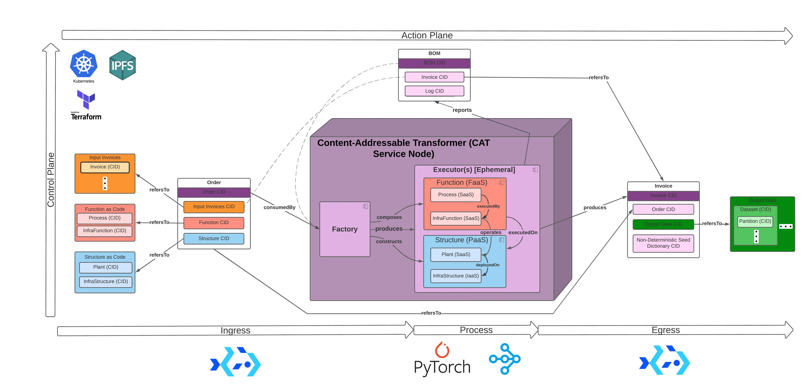
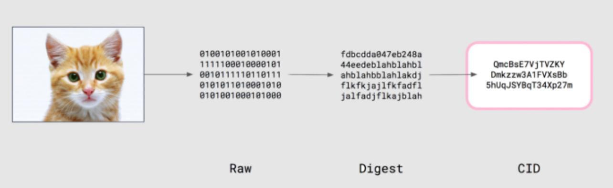
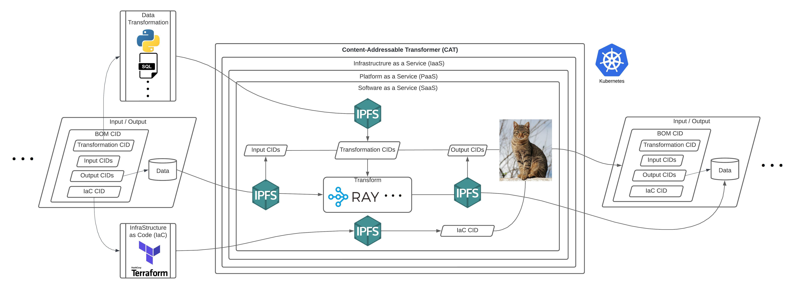
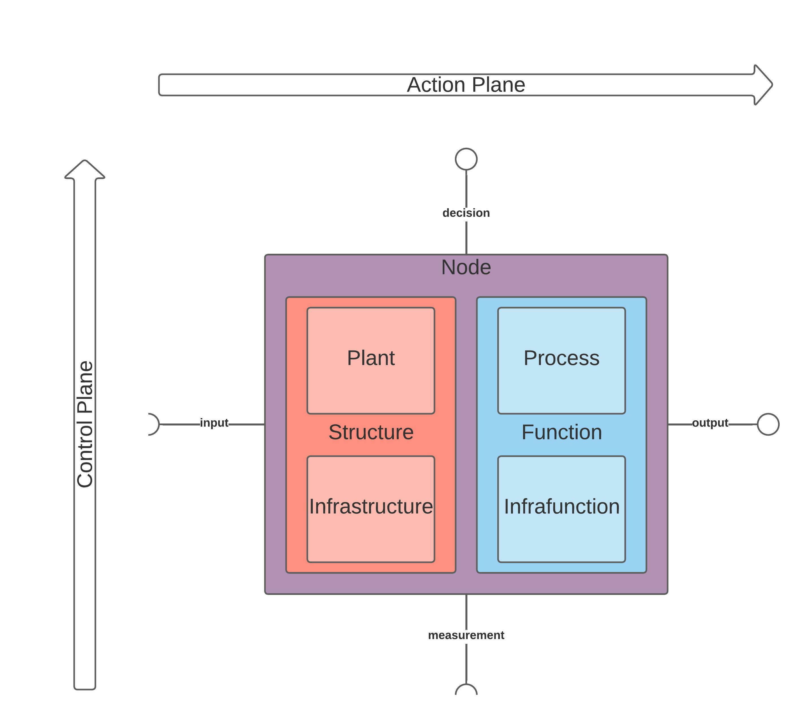
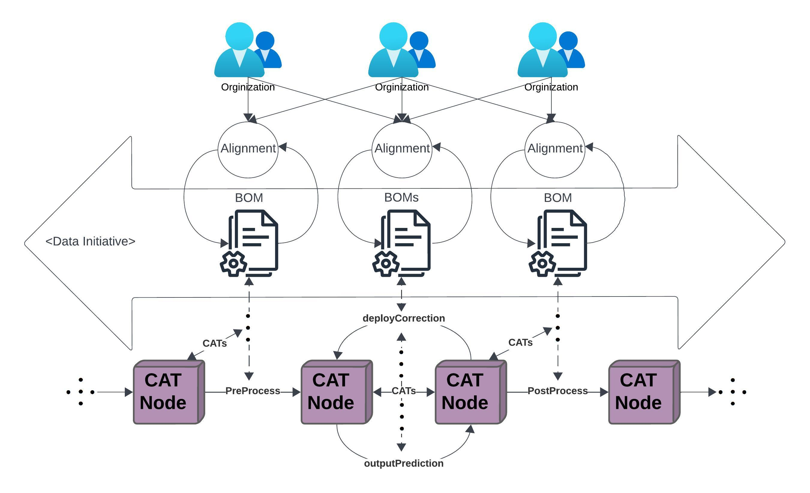
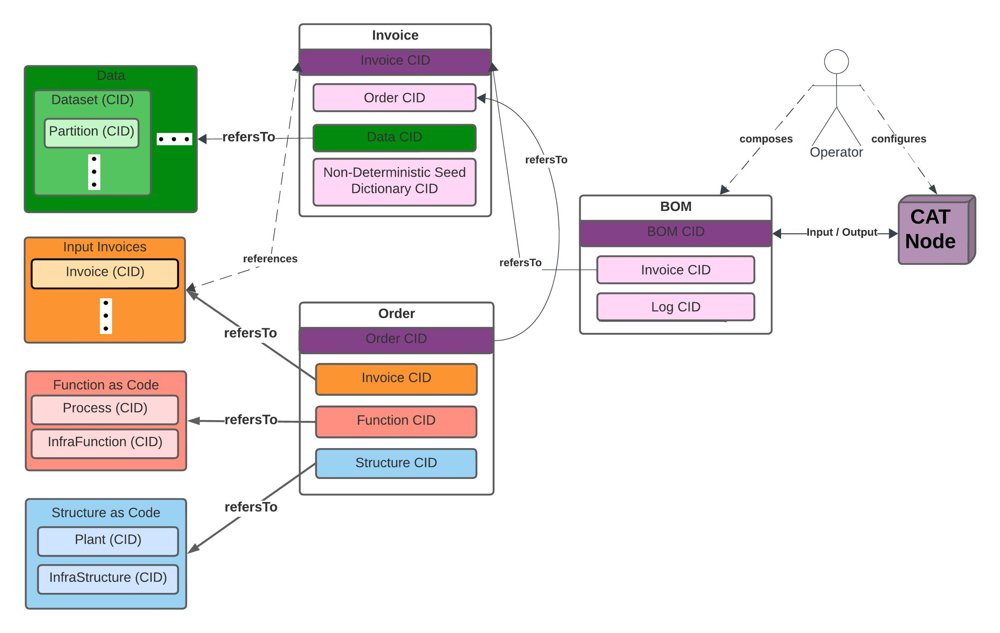
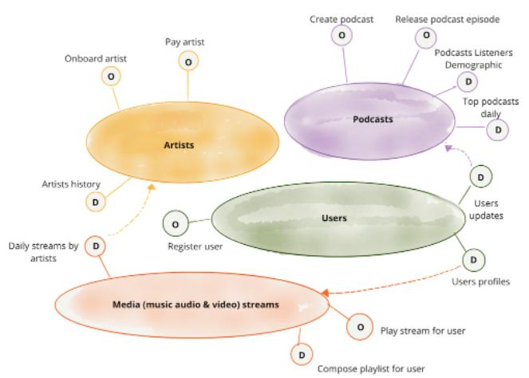

# CATs: Content-Addressable Transformers


## Description:
**Content-Addressable Transformers** (**CATs**) is a unified Data Service Collaboration framework for organizations. 
CATs connect collaborators between organizations on a Data Mesh with interoperable parallelized and distributed 
computing at horizontal & vertical scale. CATs' establish a scalable and self-serviced Data Platform as a Data Mesh 
network of scalable and interoperable distributed computing workloads with Data Provenance deployable on Kubernetes. 
These workloads [CAT(s)] enable for Big Data processing with Scientific Computing capabilities. CATs are integration 
points which enable scaled data processing portability between client-server cloud platforms and mesh (p2p) networks 
with minimal rework or modification. 

CATs enables the 
[continuous reification of **Data Initiatives**](https://github.com/BlockScience/cats?tab=readme-ov-file#continuous-data-initiative-reification) 
by cataloging discoverable, accessable, and re-executable workloads as 
 [**Data Service Collaboration**](https://github.com/BlockScience/cats?tab=readme-ov-file#continuous-data-initiative-reification) 
composable records between organizations. These records provide a reliable and efficient way to manage, share, and 
reference data processes via [**Content-Addressing**](https://en.wikipedia.org/wiki/Content-addressable_storage) Data 
Provenance records.

**Content-Addressing** is a method of uniquely identifying and retrieving data based on its content rather than its 
location or address. CATs provides verifiable data processing and transport on a Mesh network of CATs interconnected by 
Content-Addressing Data Provenance records with [IPFS](https://ipfs.io/) 
[**CIDs**](https://docs.ipfs.io/concepts/content-addressing/) (Content-Identifiers) as content addresses issued by IPFS 
**[client](https://docs.ipfs.io/install/command-line/#official-distributions)** to identify and retrieve inputs, 
transformations, outputs, and infrastructure (as code [IaC]) for verifying transformation accuracy given CIDs.


### Specification:
CATs' utilizes [Ray](https://www.ray.io/) for interoperable & parallelized distributed computing frameworks deployable 
on **[Kubernetes](https://kubernetes.io/)** for Big Data processing with Scientific Computing. Ray is a unified compute 
framework that enables the development of parallel and distributed applications for scalable data transformation, 
Machine Learning, and AI. Ray provides CATs with interoperable computing frameworks with its 
[ecosystem integrations](https://docs.ray.io/en/latest/ray-overview/ray-libraries.html) such as 
[Apache Spark](https://spark.apache.org/), and [PyTorch](https://pytorch.org/).

Ray is deployed as an execution middleware on top of [Bacalhau’s](https://www.bacalhau.org/) [Compute Over Data (CoD)](https://github.com/bacalhau-project/bacalhau). 
CoD enables IPFS to serve as CATs' Data Mesh's network layer to provide parallelized data ingress and egress for IPFS 
data. This portability closes the gap between data analysis and business operations by connecting the network planes of 
the cloud service model (SaaS, PaaS, IaaS) with IPFS. CATs connect these network planes by enabling the instantiation of 
FaaS with cloud services in AWS, GCP, Azure, etc. on a **Data Mesh** network of CATs. CoD enables this connection as p2p 
distributed-computing job submission in addition to the client-server job submission provided by Ray.


### Get Started!:
0. **Install [Dependencies](./docs/DEPS.md)**
1. **Install CATs:**
    ```bash
    git clone git@github.com:BlockScience/cats.git
    cd cats
    # Optional: Create Virtual Environment
    # python -m venv ./venv
    # source ./venv/bin/activate
    python -m pip install --upgrade pip
    pip install dist/*.whl
    ```
2. **Demo:** [**Establish a CAT Mesh**](./docs/DEMO.md)
3. **Test:** [**CAT Mesh Verification**](./docs/TEST.md)

### [Contribute!](docs/CONTRIBUTING.md)

### CATs' Architectural Quantum:
Organizations and collaborators participating will employ CATs for rapid ratification of service agreements within 
collaborative feedback loops of [**Data Initiatives**](https://github.com/BlockScience/cats?tab=readme-ov-file#continuous-data-initiative). 
CATs' apply an **Architectural Quantum** Domain-Driven Design principle described in 
[**Data Mesh of Data Products**](https://martinfowler.com/articles/data-mesh-principles.html) to reify Data Initiatives.
(* [**Design Description**](docs/DESIGN.md))


### Continuous Data Initiative Reification:
**Data Initiatives** will be naturally reified as a result of **Data Service Collaboration** on CATs. CATs will be 
compiled and executed as interconnecting services on a Data Mesh that grows naturally when organizations communicate 
CATs provenance records within feedback loops of Data Initiatives.


### CATs' Data Provenance Record:
**BOM (Bill of Materials)** are CATs' Content-Addressed Data Provenance record for verifiable data processing and 
transport on a Mesh network of CATs. BOMs are used as CAT’ input & output that contain CATs’ means of data processing.
* BOMs employ CIDs for location-agnostic retrieval based on its content as well as processes and 
[Data Verification](https://en.wikipedia.org/wiki/Data_verification). BOM CIDs can be used to verify the means of processing 
data (input, transformation / process, output, infrastructure-as-code (IaC)) they can also make CATs resilient by 
enabling re-execution via retrieval. CATs certifies the accuracy of data processing on data products and pipelines by 
enabling maintenance and reporting of 
[data and process lineage & provenance](https://bi-insider.com/posts/data-lineage-and-data-provenance/) as chains of 
evidence using CIDs.

* CAT Mesh is composed by CATs executing BOMs.


### CAT Mesh: CATs Data Mesh platform with Data Provenance
**CAT Mesh** is a self-serviced Data Mesh platform with Data Provenance. **CAT Nodes** are CAT Mesh peers that enable 
workloads to be portable between client-server cloud platforms and p2p mesh network with minimal rework or modification.

Multi-disciplinary and cross-functional teams can use CAT Nodes to verify and scale distributed computing workloads. 
Workloads (CATs) executed by CAT Nodes interface cloud service model (SaaS, PaaS, IaaS) offered by providers such as 
AWS, GCP, Azure, etc. on a Mesh Network interconnected by IPFS. 

CAT Nodes are **Data Products** - peer-nodes on a mesh network that encapsulate components (*) to function as a service 
providing access to a domain's analytical data as a product; * code, data & metadata, and infrastructure.

**In the following image:** 
* Large ovals in the image above represent **Data Products** servicing each other with Data
* "O" ovals are Operational Data web service endpoints
* "D" ovals are Analytical Data web service endpoints
* Source: [Data Mesh Principles and Logical Architecture](https://martinfowler.com/articles/data-mesh-principles.html) - Zhamak 
Dehghani, et al.


## Key Concepts:
* **[Data Verification](https://en.wikipedia.org/wiki/Data_verification)** - a process for which data is checked for 
accuracy and inconsistencies before processed
* **[Data Provenance](https://bi-insider.com/posts/data-lineage-and-data-provenance/)** - a means of proving data 
lineage using historical records that provide the means 
of pipeline re-execution and **[data validation](https://en.wikipedia.org/wiki/Data_validation)**
* **[Data Lineage](https://bi-insider.com/posts/data-lineage-and-data-provenance/)** - reporting of data lifecyle from 
source to destination
* **[Distributed Computing](https://en.wikipedia.org/wiki/Distributed_computing)** - typically the concurrent and/or 
parallel execution of job tasks distributed to networked computers processing data
* **[Bill of Materials (BOM)](https://en.wikipedia.org/wiki/Bill_of_materials)** - an extensive list of raw materials,
components, and instructions required to construct, manufacture, or repair a product or service

### Image Citations:
* **["Illustrated CAT"](https://github.com/BlockScience/cats#illustrated-cat)**
  * [Python logo](https://tse4.mm.bing.net/th?id=OIP.ubux1yLT726_fVc3A7WSXgHaHa&pid=Api)
  * [SQL logo](https://cdn3.iconfinder.com/data/icons/dompicon-glyph-file-format-2/256/file-sql-format-type-128.png)
  * [Terraform logo](https://tse2.mm.bing.net/th?id=OIP.1gAEVon2RF5oko4iWCfftgHaHO&pid=Api)
  * [IPFS logo](https://tse1.mm.bing.net/th?id=OIP.BRyW5Tdm5_6VQxCsGr_sQAHaHa&pid=Api)
  * [cat image](https://tse1.mm.bing.net/th?id=OIP.xS_itpeyTImMcrcQ_YNsfQHaIu&pid=Api)
  * [ray.io logo](https://open-datastudio.io/_images/ray-logo.png)
  
