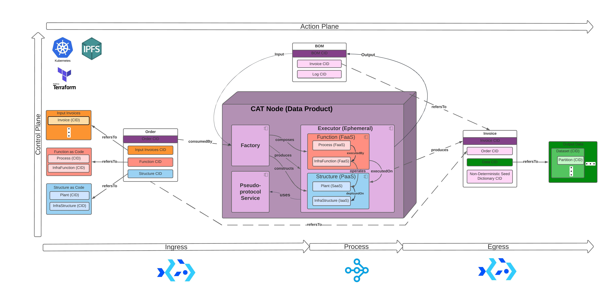
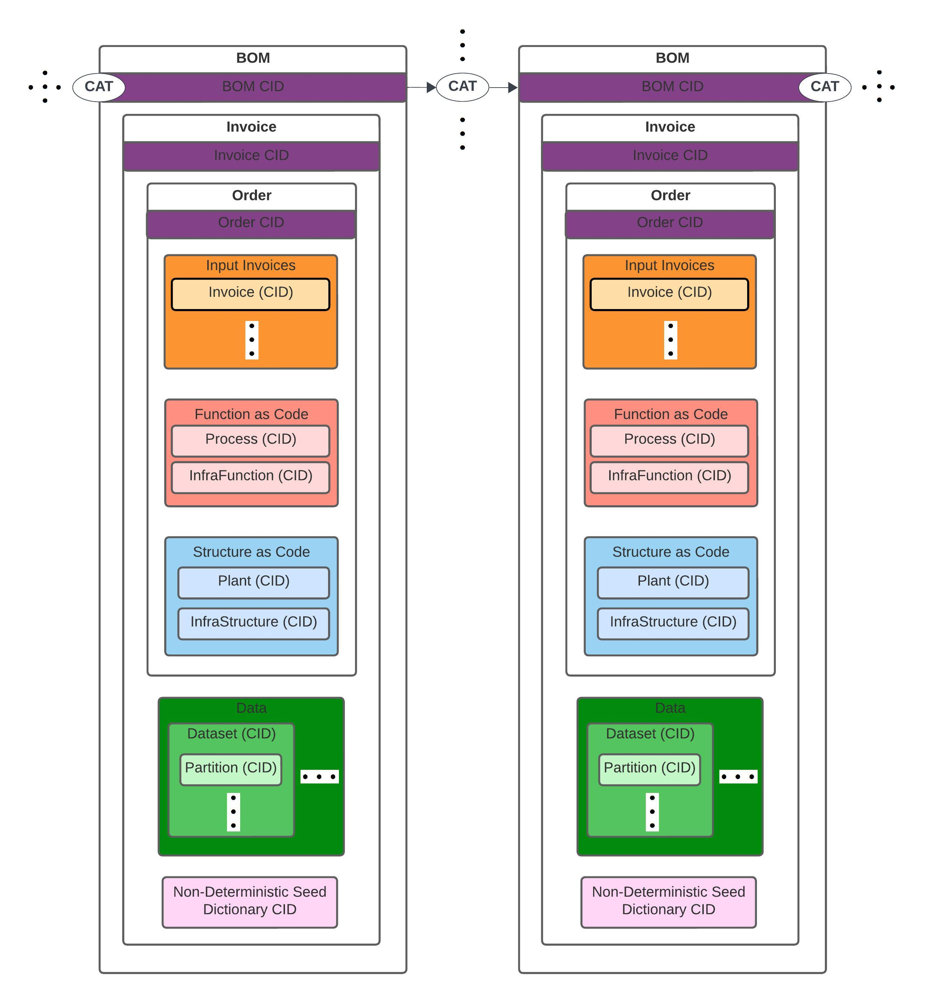

# CATs: Content-Addressable Transformers


## Description
**Content-Addressable Transformers** (**CATS**) is a unified data service collaboration framework that establishes a scalable and 
self-serviced Data Platform as a Data Mesh network of scalable & distributed computing workloads with Data Provenance. 
CATs uses interoperable distributed computing frameworks deployable on Kubernetes.

**Data Service Collaboration:**

CATs streamline Data Service collaboration between organizations by providing a reliable and efficient way to manage, 
share, and reference data and data processing via 
[**Content-Addressing**](https://en.wikipedia.org/wiki/Content-addressable_storage) - a method of uniquely identifying 
and retrieving data based on its content rather than its location or address.

**Uses-cas for Data Service collaboration:**
* Organizations participating in Strategic Partnerships will employ CATs for rapid ratification of service agreements 
within collaborative feedback loops of Data Initiatives
* CATs will be compiled and executed as interconnecting services on a Data Mesh that grows naturally when organizations 
communicate CATs provenance records within feedback loops of Data Initiatives


### CAT Mesh: CATs Data Mesh platform with Data Provenance
**CAT Mesh** is a self-serviced Data Mesh platform with Data Provenance. **CAT Nodes** are CAT Mesh peers that enable 
workloads to be portable between Web2 & Web3 infrastructure with minimal rework or modification. 

[**CAT Mesh Design:**](docs/DESIGN.md)

CAT Node uses the Architectural Quantum Domain-Driven Design principle described in 
[**Data Mesh of Data Products**](https://martinfowler.com/articles/data-mesh-principles.html)


CAT Mesh closes the gap between data analysis and business operations by connecting Web3 and Web2 network planes. 
Multi-disciplinary and cross-fuctional teams can use CAT Nodes to verify and scale distributed computing workloads with 
Data Provenance using interoperable computing frameworks deployable on **[Kubernetes](https://kubernetes.io/)** for Big 
Data processing with Scientific Computing capabilities.

CAT Mesh workloads (CATs) executed by CAT Nodes interface cloud service model (SaaS, PaaS, IaaS) offered by providers 
such as AWS, GCP, Azure, etc. on a Mesh Network interconnected by [IPFS](https://ipfs.io/).
CAT Nodes use [IPFS](https://ipfs.io/) to interconnect with CAT Mesh in the following ways:
* IPFS **[CIDs](https://docs.ipfs.io/concepts/content-addressing/)** (Content-Identifiers) are used as content addresses 
that provide the means of verifying data transformation accuracy.
* IPFS **[client](https://docs.ipfs.io/install/command-line/#official-distributions)** is used to identify and retrieve 
inputs, transformations, outputs, and infrastructure (as code [IaC]) for verifying transformation accuracy given CIDs


CAT Nodes are **Data Products** - peer-nodes on a mesh network that encapsulate components (*) to function as a service providing access to 
a domain's analytical data as a product; * code, data & metadata, and infrastructure


**Image Description:** 
* Large ovals in the image above represent **Data Products** servicing each other with Data:
* "O" ovals are Operational Data web service endpoints
* "D" ovals are Analytical Data web service endpoints
* [Data Mesh Principles and Logical Architecture](https://martinfowler.com/articles/data-mesh-principles.html) - Zhamak Dehghani, et al.


### CATs' Data Provenance Record: Bill of Materials
**BOM (Bill of Materials):** 
CATs Content-Addressed Data Provenance record for verifiable data processing and transport on 
a Mesh network of CATs. BOMs are used as CAT’ input & output that contain CATs’ means of data processing


BOMs employ CIDs for location-agnostic retrieval based on its content as well as processes and 
[Data Veification](https://en.wikipedia.org/wiki/Data_verification). BOM CIDs can be used to verify the means of processing 
data (input, transformation / process, output, infrastructure-as-code (IaC)). they can also 
make CATs resilient by enabling re-execution via retrieval. CATs certifies the accuracy of data processing on data 
products and pipelines by enabling maintenance & reporting of 
[data and process lineage & provenance](https://bi-insider.com/posts/data-lineage-and-data-provenance/) as chains of 
evidence using CIDs.

### Establish a CAT Mesh:

CAT Mesh is composed by CATs executing BOMs.



### Get Started!
##### A. Installation:
0. **[Python](https://www.python.org/downloads/)** (>= 3.10.13)
1. **[kind](https://kind.sigs.k8s.io/docs/user/quick-start/#installing-from-release-binaries)** (>= 0.12.0)
2. **[kubectl](https://kubernetes.io/docs/tasks/tools/install-kubectl-linux/)** (>= 1.22.2)
3. **[helm](https://helm.sh/docs/intro/install/)** (>= v3.13.1)
4. **[CoD](https://docs.bacalhau.org/getting-started/installation/)** (>= v1.2.0)
   ```bash
   curl -sL https://get.bacalhau.org/install.sh | bash
   ```
5. **[Terraform](https://developer.hashicorp.com/terraform/tutorials/aws-get-started/install-cli)** (>= 1.5.2)
6. **[IPFS Kubo](https://docs.ipfs.tech/install/command-line/#system-requirements)** (0.24.0)
7. **[AWS S3](https://aws.amazon.com/s3/)**
8. **Install CATs**
    ```bash
    git clone ...
    pip install -r requirements.txt
    ```
#####  B. [Prepare CAT Node's Execution Environment](./docs/ENV.md)
#####  C. Deploy CAT Node:
  ```bash
  cd <CATs parent directory>/cats-research
  source ./venv/bin/activate
  # (venv) $
  PYTHONPATH=./ python catMesh/cat/node.py
  ```
#####  C. [Establish CAT Mesh](./cats_demo.ipynb)

### Key Concepts:
* **[Data Verification](https://en.wikipedia.org/wiki/Data_verification)** - a process for which data is checked for 
accuracy and inconsistencies before processed
* **[Data Provenance](https://bi-insider.com/posts/data-lineage-and-data-provenance/)** - a means of proving data lineage using historical records that provide the means 
of pipeline re-execution and **[data validation](https://en.wikipedia.org/wiki/Data_validation)**
* **[Data Lineage](https://bi-insider.com/posts/data-lineage-and-data-provenance/)** - reporting of data lifecyle from source to destination
* **[Distributed Computing](https://en.wikipedia.org/wiki/Distributed_computing)** - typically the concurrent and/or 
parallel execution of job tasks distributed to networked computers processing data
* **[Bill of Materials (BOM)](https://en.wikipedia.org/wiki/Bill_of_materials)** - an extensive list of raw materials,
components, and instructions required to construct, manufacture, or repair a product or service

### Image Citations:
* **["Illustrated CAT"](https://github.com/BlockScience/cats#illustrated-cat)**
  * [Python logo](https://tse4.mm.bing.net/th?id=OIP.ubux1yLT726_fVc3A7WSXgHaHa&pid=Api)
  * [SQL logo](https://cdn3.iconfinder.com/data/icons/dompicon-glyph-file-format-2/256/file-sql-format-type-128.png)
  * [Terraform logo](https://tse2.mm.bing.net/th?id=OIP.1gAEVon2RF5oko4iWCfftgHaHO&pid=Api)
  * [IPFS logo](https://tse1.mm.bing.net/th?id=OIP.BRyW5Tdm5_6VQxCsGr_sQAHaHa&pid=Api)
  * [cat image](https://tse1.mm.bing.net/th?id=OIP.xS_itpeyTImMcrcQ_YNsfQHaIu&pid=Api)
  * [ray.io logo](https://open-datastudio.io/_images/ray-logo.png)
  
