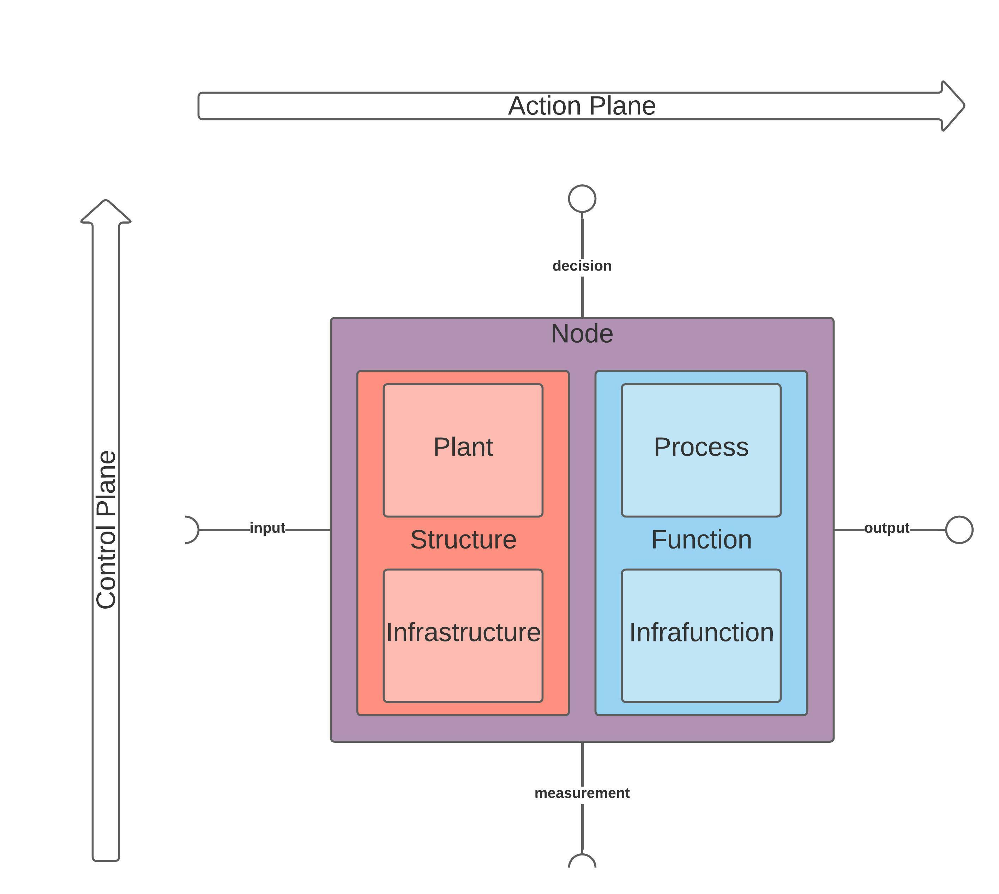
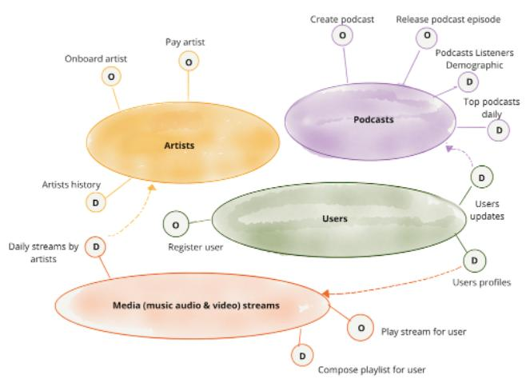

# Domain-Driven Design: CAT Node's Quantum Architecture Principle:

CAT Node uses the Architectural Quantum Domain-Driven Design principle described in 
[**Data Mesh of Data Products**](https://martinfowler.com/articles/data-mesh-principles.html)

This design principle enables effective cross-domain collaboration on Data Products across business and 
knowledge domains between cross-functional & multi-disciplinary teams and organizations.

CAT’s architectural design and implementation are the result of applied Engineering, Computer Science, Network Science, 
and Social Science. CATs is software executing on a network client ontological to an MicroKernel Operating System. CATs’ 
is designed to enable Data Products implemented as compute node peers on a Data Mesh network that encapsulate code, 
data, metadata, and infrastructure to function as a service providing access to the business domain's analytical data as 
a product. Data Products use the Architectural Quantum domain-driven design principle for peer nodes that represent the 
“smallest unit of architecture that can be independently deployed with high functional cohesion, and includes all the 
structural elements required for its function” 
([“Data Mesh Principles and Logical Architecture”](https://martinfowler.com/articles/data-mesh-principles.html#:~:text=smallest%20unit%20of%20architecture%20that%20can%20be%20independently%20deployed%20with%20high%20functional%20cohesion%2C%20and%20includes%20all%20the%20structural%20elements%20required%20for%20its%20function.) - Zhamak Dehghani, et al.).

### Description: CATs' Architectural Quantum (AQ) as a [Minimal Federated Operating Model](https://www.starburst.io/blog/data-mesh-book-bulletin-principle-of-federated-computational-governance/)

- **Function [FaaS]** is a Function-as-a-Service for scalable Data Processing and analytics: **Process [Composed Function]** + **InfraFunction [Actuator]**, authored via the **REPLaC (REPL as Code) Workflow UI** of Function [FaaS] (this demo: Marimo, e.g. [`cats_demo.py`](../notebooks/cats_demo.py)). *Functions* are deployed on **Structure [PaaS]**; mutating either *Process* or *InfraFunction* updates the CAT **Order** in alignment with CATs *Architectural Quantum’s* Functionality
  - **Process [Composed Function]** is the composed callable graph (FaaS-composer analogue): transport **port** callables (**ingress / integration_cache / egress**) plus `**integrated_subproc`** — the hotF, i.e. the input→output data transform ([transfer function](https://en.wikipedia.org/wiki/Transfer_function)) via Plant-agnostic `ComputePort.run_transfer`, often higher-order because it applies a batch function (e.g. via Ray `map_batches`). Process is the composition, not the notebook UI and not itself a hotF. Mutating a ***Function's* Process [Composed Function]** produces a new **Order** whose `function_uri` (equality `ni:`) reflects that update, for the Node's Factory to process on the next execution (*)
  - **InfraFunction [Actuator]** receives the hotF **Process [Composed Function]** submits and dispatches it onto the Plant (SaaS) via `PlantPort`; transport callables run locally around that dispatch, not as Plant jobs
    - Mutating InfraFunction [Actuator]'s dispatch configuration produces a new Order whose updated `function_uri` carries the updated actuator, alongside any Process-composed callable content ids and any resulting `structure_uri` update reflecting the **Plant [SaaS]** it now targets (*)
- **Structure [PaaS(as IaC)]** provisions and maintains the **Plant [SaaS]** as **Function’s [FaaS]** scalable execution environment. 
  - **Plant [SaaS]** is composed from **InfraStructure [IaaS]** as **Structure's** dynamically scaled execution environment of 
  **Function [FaaS]** — the runtime onto which **InfraFunction [Actuator]** dispatches the hotF (`integrated_subproc`) submitted by **Process [Composed Function]**
  - **InfraStructure (IaaS)** provisions and maintains the dynamically scaled infrastructure that composes a Plant (SaaS).
    - The CAT Order is updated in alignment with event-driven functionality and operations: mutating InfraStructure 
    (IaaS)'s provisioning produces a new Order with an updated `structure_uri` (*)

(* Each of these Order mutations produces the next Order a subsequent CAT execution processes - see
**[ControlFeedbackLoop.md](ControlFeedbackLoop.md)**, whose step-2 note documents how that next Order is discovered
via the Node-local BOM registry (`content_id` / `data_uri` / `bom_ldp_uri`) rather than only supplied out-of-band as `order_uri`
([`BomRegistry.md`](BomRegistry.md)).)

Each of these components is content-addressed and reconstituted at runtime with the same composition it was minted with: the Factory consumes a single **Order** (HTTP `order_uri`, equality `ni:`) - resolving to Input Invoice, Function, and Structure `*_uri` locators - composes `Function` and constructs `Structure` from those content ids, then instantiates a fresh, ephemeral **Executor** per CAT execution with them as its dependencies - `Structure` in turn composing its `Plant` from its `InfraStructure`, and `Function` its `Process` from its `InfraFunction` - and the Executor itself (not a layer above it) produces the resulting **Invoice** (`invoice_uri` / `ni:`).

### How the Architectural Quantum is realized as content-addressed `ni:` / HTTP `*_uri`:

The Quantum's "smallest unit of architecture... with high functional cohesion" is realized concretely as a single content-addressed **Order**, consumed by the **Factory** to produce a fresh, ephemeral **Executor** per CAT execution - the Quantum's independently-deployable unit, instantiated anew for every Order rather than kept as standing infrastructure:

- Order JSON at `order_uri` carries `{invoice_uri, function_uri, structure_uri}` - the Order's Input Invoice, Function (as Code), and Structure (as Code), each independently content-addressed (`ni:` equality; fetch via CAS-over-HTTP).
- `structure_uri` resolves to `{root_uri, plant_uri, infrastructure_uri}` - Structure (**PaaS** as **IaC**) is an apply-complete pairing: compose-root glue (`root_uri`: `main.tf` / providers / module wiring), the Plant (SaaS) it provisions (`plant_uri`), and the InfraStructure (IaaS) that provisions it (`infrastructure_uri`).
- `function_uri` resolves to `{process_uri, infrafunction_uri, process_source_uri, infrafunction_source_uri}` - Function [FaaS] is a hybrid pairing: bind JSON for Process [Composed Function] (transport **port** callables plus a Higher-Order Transfer Function [hotF] — the input→output data transform via `ComputePort.run_transfer`) and InfraFunction [Actuator], plus directory content ids of the Process / InfraFunction source packages. Each slot leaf is named-bind JSON (`contentId` / `source_uri` / `module` / `qualname`) for stock public callables, or pickle bytes for REPL one-offs. Orders are authored via the REPLaC Workflow UI of Function [FaaS] (Marimo in this demo).

The **Factory** reconstitutes this Quantum at runtime with the same composition it was minted with: it composes `Function` and constructs `Structure` from the Order's `function_uri`/`structure_uri`, then instantiates the **Executor** with them as its dependencies. Each in turn composes its own content-addressed sub-component the same way - `Structure` composes its `Plant` from its `InfraStructure`, and `Function` composes its `Process` from its `InfraFunction` - so Function [FaaS] executes on Structure [PaaS] by InfraFunction [Actuator] dispatching the hotF (`integrated_subproc`) submitted by Process [Composed Function] onto Plant [SaaS], while ingress / integration_cache / egress run as local transport around that dispatch, exactly as the Quantum's applied disciplines describe below. Composition stays on the Order `*_uri` graph (sequential Executor stages); Control-Feedback Loop feedback uses Invoice stage locators (`data_stages_uri` / `ingressed_data_uri` / `integrated_data_uri` / `data_uri`) alongside a populated Seed (`seed_uri` → `{seed, rng_seed, num_partitions}`, minted fresh per execution) — stage content ids remain the data-product feedback surface while partition count is still selected from env rather than read from Seed. The Executor itself - not a layer above it - is what produces the resulting **Invoice**, so the whole Order-in/Invoice-out cycle stays within the one independently-deployable, functionally-cohesive unit the Quantum principle calls for. (* **[content-id details](BOM.md)**, * **[Lineage-of-Provenance context](LineageOfProvenance.md)**)

### Example: Data Product Design Domains on a CAT Node Mesh

**In the following image:**
- Large ovals in the image above represent **Data Products** servicing each other with Data
- "O" ovals are Operational Data web service endpoints
- "D" ovals are Analytical Data web service endpoints
- Source: [Data Mesh Principles and Logical Architecture](https://martinfowler.com/articles/data-mesh-principles.html) - Zhamak Dehghani, et al.

### Data Product Team Example: 
Multidisciplinary Data Product teams can *operate, contribute, and maintain* different portions of the entire cloud service model based on role in adherence to the AQ.
* Applied discipline for **Functions (FaaS)**
  * **Data Science** involves exploratory data analysis (EDA), data cleaning and visualization, and 
  predictive modeling / machine learning to inform Control Plane decisions and strategies. 
  * **Machine Learning Engineering** involves the development, training, performance optimizing, and deployment of machine learning models as a scalable **Integration** function composed in Process [Composed Function] and dispatched onto Plant by InfraFunction [Actuator]. 
  * **Data Analysis** involves evaluating performance of and implementing the Process [Composed Function] using a data processing language and scheduling them for submission to the InfraFunction [Actuator] for execution.
  * The CAT Order is updated with the inclusion of resulting mutated Functions (FaaS) for execution processed by CATs 
  Factory Client.
* Applied discipline for **Structure (PaaS** as **IaC)**
  * **Data Platform / Cloud / Infrastructure Engineering** involves the design and IaC development, and automation of the 
  provisioning and management of Structure (PaaS) executing Function. This is accomplished using IaC to provision 
  InfraStructure (IaaS) as the execution paradigm of the Plant (SaaS) as well as contributing to InfraFunction
  [Actuator] execution configurations of Plant (SaaS) operations.

### [**Organizational Value**](./ORG.md)