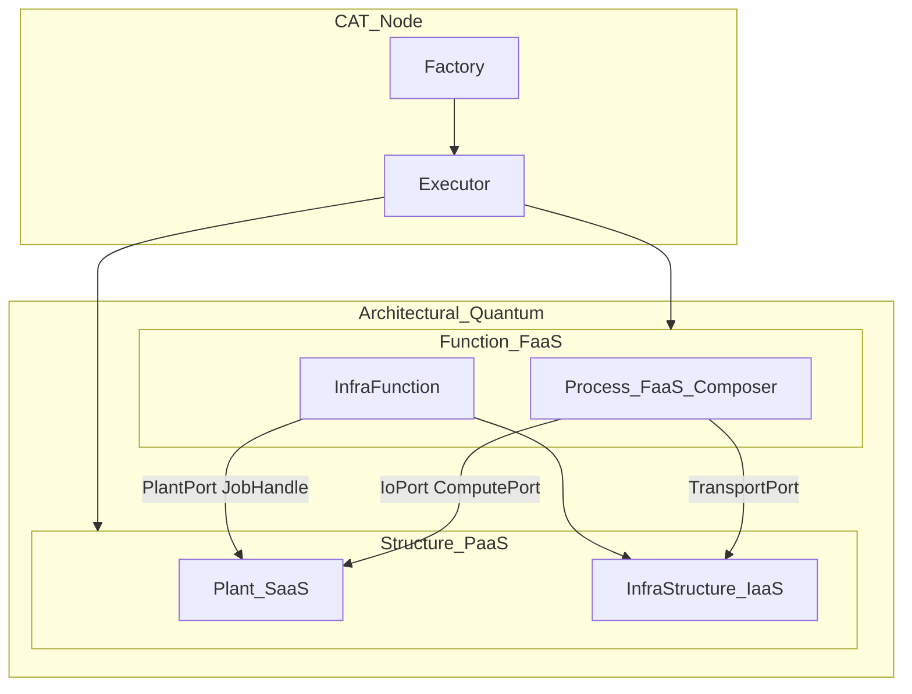

# Architectural Quantum Interoperability

Plans to **prove** interoperability for every Architectural Quantum (AQ) component and
sub-component — not only that ports exist for today’s KubeRay demo.

See [`COMPONENTS.md`](./COMPONENTS.md), [`ControlFeedbackLoop.md`](./ControlFeedbackLoop.md),
[`PLANTs.md`](./PLANTs.md), [`BOM.md`](./BOM.md), and [`STORAGE.md`](./STORAGE.md).

## What “proved” means

| Claim | Evidence |
|-------|----------|
| **Contract-complete** | Function-owned ports / allowlists exist; Structure adapters implement them; CI guards the surface |
| **Demo-proved** | At least one end-to-end Order path exercises that contract (today: Ray/KubeRay + MinIO + host Kubo) |
| **Interop-proved** | The **same** Function CID graph (Process + InfraFunction callables) runs successfully against **≥2** Structure adapter sets (different Plant and/or T&D backends) without changing Process/InfraFunction source |

Today CATs is largely **contract-complete** and **demo-proved** on one stack. This document tracks
what remains to become **interop-proved** per AQ piece.



## Port map (Function ↔ Structure seams)

These seams are how interoperability is supposed to work without rewriting Function CIDs:

| Port / API | Owner (Function) | Adapter (Structure) | Demo implementation |
|------------|------------------|---------------------|---------------------|
| **TransportPort** | Process ingress / egress / integration_cache (`n=1`); kwargs `input_dir_id`. Protocol is Function-owned; Executor applies `as_transport_port` | `TransportContext` | **CAS** materialize/`put_tree` for `ni:` / HTTP URI only ([CAS-only](W3C.md#6s-cas-only-node) — legacy CID fail closed; no Docker peers) |
| **IoPort** | Process ingress / egress when `num_partitions > 1`; kwargs `input_dir_id` | `RayIoPort` (`plant/ray_io_utils.py`) | Opaque `part-NNNNN` file/dir layout via ContentMesh / AddressStore (CAS `put_dir` → `ni:`; [opaque partition layout](W3C.md#6p-opaque-partition-layout) — no Kubo CAR mint); optional Plant job (`CATS_IO_VIA_JOB`) with `io_args`/`io_result` keys `input_id` / `layout_id` |
| **ComputePort** | Process `process_*` hotF | `RayComputePort` (job working_dir) | Ray Data `map_batches`; `num_partitions` aligns blocks to `part-*` layout |
| **PlantPort** | InfraFunction actuator | `RayPlantPort` | Ray Job Submission |
| **JobHandle** / ObjectStore | InfraFunction scratch correlator; durable Entity Relationship façade (`structure_id`) | `begin_job` / `write_job_scratch`; `er_uri` / `promote_er` / `resolve_er` / `gc_er` | Scratch MinIO `cats-scratch` + durable MinIO `cats-durable` |

**Partition I/O:** set `CATS_IO_PARTITIONS=n` (`n=1` default keeps TransportPort.migrate). For `n>1`, ingress/egress use IoPort and produce/consume a directory of opaque `part-00000` … `part-{n-1:05d}` files or directories (stable shuffle keys; CAS digest-keyed manifest via `put_dir` — [opaque partition layout](W3C.md#6p-opaque-partition-layout), no Kubo `add`/`dag_export`). Legacy layouts may still contain `part-*.car` (read-only one cycle). Invoice stage fields remain single root content ids (`ni:`) plus Phase 2b companion `*_uri` when minted. Invoice `seed_cid` now *records* the `num_partitions` observed for the run (plus a Process/NumPy-usable `rng_seed` int a second Plant's `ComputePort` may map to its own engine RNG); `CATS_IO_PARTITIONS` remains the demo-fallback *selector* of `n` until the Executor reads it from Seed instead ([#187](https://github.com/DynamicalSystemsGroup/cats/issues/187); see [`populate_invoice_seed_field`](../.cursor/plans/populate_invoice_seed_field_c499fe02.plan.md) plan).

Process public surface is locked by `process.__all__` and
[`tests/test_process_public_surface.py`](../tests/test_process_public_surface.py)
(named imports only; `TYPE_CHECKING` port types for Ray unpickle).

## Interop status by AQ component

### Top-level Node components ([`COMPONENTS.md`](./COMPONENTS.md))

| Component | Interop role | Status | Prove plan |
|-----------|--------------|--------|------------|
| **Factory** | Assembles Executor from Order CIDs; must not embed Plant/Ray | Demo-proved (generic compose) | Keep Factory free of adapter imports; regression: Order with alt `structure_cid` still composes |
| **Architectural Quantum** | Function CID + Structure CID pairing | Contract-complete; one Structure proven | Same `function_cid` + second `structure_cid` (see **2f**) |
| **Executor** | Wires ports (`as_transport_port`, `plant_port()`, `obj_store_context`). `as_transport_port` lives in `cats.executor.function` (CFL 4A); must not import the Order `data` package | Demo-proved | Assert Executor only passes ports/handles — never `JobSubmissionClient` / container names; grep-guard `from data.` / `import data` in `cats/` |

### Function [FaaS]

| Sub-component | Contract | Status | Prove plan |
|---------------|----------|--------|------------|
| **Process [Composed Function]** | `TransportPort` Protocol (Function-owned, `data/input/function/process/transport_port.py`) + `IoPort` + `ComputePort`; no Ray; public `__all__`; no `as_transport_port` | Contract + demo (Ray adapters behind IoPort / ComputePort) | Unchanged Process modules against second Plant adapters (**2f**); keep `TYPE_CHECKING`-only `data.*` imports |
| **InfraFunction [Actuator]** | `PlantPort` + `JobHandle`; no Job Submission client | Contract + demo (RayPlantPort) | Unchanged `infrafunction_subproc` against second PlantPort + scratch landing (**2f**) |

### Structure [PaaS]

| Sub-component | Contract | Status | Prove plan |
|---------------|----------|--------|------------|
| **Plant [SaaS]** | Implements `PlantPort`; BOM snapshot may stay tool-specific | Demo-proved (KubeRay only) | **2f**: second Plant module (non-Ray) with `plant_port_from_context` equivalent |
| **InfraStructure [IaaS] — content-store** | Node CAS (ContentMesh); optional host Kubo CLI | Demo-proved [CAS-only](W3C.md#6s-cas-only-node) | Kubo not required for Function interop |
| **InfraStructure [IaaS] — T&D transport** | `TransportContext` / `TransportPort` | Demo-proved CAS migrate/stage ([CAS-only](W3C.md#6s-cas-only-node)) | Optional second transport adapter only if a Plant cannot use CAS; Function stays on `TransportPort` |
| **InfraStructure [IaaS] — object store** | `ObjectStore` / `JobHandle` + durable Entity Relationship | Demo-proved (dual MinIO: scratch + durable); **2g** JobHandle-only `result_uri` / `download_job_result` | **2f** may keep MinIO; alternate scratch backend needs `begin_job` / `download_job_result` / Plant-owned entrypoint landing; durable ER is structure-NS + `er/current` pointers |

## 2f. Second Plant (interop incomplete as product)

**Gap:** Ports exist; only **Ray** adapters ship (`RayComputePort`, `RayPlantPort`, Ray CSV entrypoint).
“Plant agnostic” is architecturally open, not demonstrated.

**Goal:** Run the **same** demo/verification Process + InfraFunction composition on a second Plant
without editing Function sources — only a new Order `structure_cid` (new `plant_cid` /
adapter modules).

**Minimum second-Plant deliverable**

1. Order-submitted Plant module implementing **PlantPort** (`submit_job` / `wait`) for a non-Ray runtime
   (e.g. local subprocess pool, plain Kubernetes Job, or Spark — product choice).
2. Matching **ComputePort** adapter (and job entrypoint or equivalent) that runs
   `batch_fn` / hotF intent without requiring Process to import that engine. Adapter may map
   engine batches onto this demo’s batch ABI (`Dict[str, np.ndarray]` for `function_0` /
   `function_1`) — see **2g**.
3. Scratch path via **JobHandle** (MinIO OK for v1 of the second Plant).
4. Demo or test: two Orders, identical Function callables, different Structure CIDs; both green.
   Recreate Orders so pickles match the post-port Process/InfraFunction surface.
5. Docs: which Plants are supported; BOM snapshot fields may differ per Plant.
6. **Structure lineage tooling:** `linkProcess()` mutates Function; **`linkStructure()`** mutates
   apply-complete `structure_cid`; **`linkOrder()`** mutates Function and/or Structure in one
   lineage step (single Invoice `data_cid` chain). Each accepts `cat_response` **or**
   `bom_cid=` / `data_cid=` via the Node-local BOM registry
   ([`BomRegistry.md`](./BomRegistry.md)). A-la-carte helpers remain
   (see [`LineageOfProvenance.md`](./LineageOfProvenance.md)). Available as Order ops for proving
   2f; second Plant adapters still required for a full interop prove. The registry-first walk in
   [`DEMO.md`](./DEMO.md) (`cats_demo.py`) is **demo-proved `linkProcess` only**;
   `linkStructure`, mesh-federated registry, and a second-Structure inspect path are listed there
   under **Not in this notebook**.
7. **Executor / Factory adapter-blind CI:** Function modules are grep-guarded against Ray /
   Job Submission; extend CI so `cats/factory`, `cats/executor`, and `cats/runtime` never import
   `JobSubmissionClient` / `import ray` / hard-coded `structure-ipfs_*`. Executor may only pass
   ports/handles (`plant_port()`, `obj_store_context()`,
   `cats.executor.function.as_transport_port(...)`). `cats/` must not `import data`
   (Order Function/Structure sources); do not load `as_transport_port` from
   `DATA_HOME` / `INPUT_HOME`.

**Non-goals for 2f**

- Dual host Kubo / firewall (old Phase C) — **P4**
- Second T&D transport / object-store backend — **P3**, only if the second Plant cannot use
  Compose Kubo + MinIO
- Rewriting Process to path-in/path-out unless the second engine cannot consume batch_fn
- Removing the Ray Plant

## 2g. Residual Ray-shaped edges (polish)

Acceptable while only KubeRay is demo-proved; clean up as interop hardens:

| Edge | Why it’s soft | Fix |
|------|---------------|-----|
| `PlantContext.job_endpoint` = Ray dashboard URL | Adapter input for `RayPlantPort`, not InfraFunction vocabulary | Leave for Ray Plant; second Plant uses its own context fields |
| Entrypoint assumes Dataset + `write_csv` | Ray compute landing | **Documented:** alternate entrypoint (or landing helper) per Plant under that Plant’s `plant_cid`; IaaS stays scratch config / `JobHandle` |
| `ObjectStore.result_uri` / `download_job_result` | Was legacy string-prefix shim | **Done:** JobHandle-only (`TypeError` otherwise) |
| BOM / verification assert MinIO key layout | Correlator is a string URI even with `JobHandle` | **Done:** asserts JobHandle URI shape (`s3://<bucket>/<prefix>/result`), not a hardcoded `cats-scratch` path |
| `batch_fn` ABI (`function_0` / `function_1` take `Dict[str, np.ndarray]`) | Orchestration left Process; callable contract is still Ray Data–shaped | **Documented** (below + `ComputePort` / `RayComputePort` docstrings); second Plant’s adapter maps engine batches → that dict (or thin the ABI later). No engine imports in Process |
| `RayComputePort` + `ray_job_result_entrypoint.py` under `plant/` | Ray landing ships in `plant_cid` | **Done:** Plant stages landing; scratch / `JobHandle` stay IaaS |

### Demo batch ABI (adapter concern)

This demo’s Process `batch_fn` contract is:

```text
Dict[str, np.ndarray] -> Dict[str, np.ndarray]
```

Process owns the math (`function_0` / `function_1`); the Plant **ComputePort** adapter owns mapping engine batches onto that shape (KubeRay: Ray Data `map_batches`). A second Plant may adapt differently — do **not** require Process rewrites unless the engine cannot feed this ABI. Thinning the ABI is deferred.

### Entrypoint per Plant

Job landing (entrypoint + compute adapter) is **Plant-owned** under `plant_cid`, staged by that Plant’s `PlantPort.submit_job`. This demo: `ray_job_result_entrypoint.py` + `RayComputePort` (Dataset + `write_csv`). Another Plant ships its own landing files; InfraStructure keeps MinIO / `ObjectStore` / `JobHandle` only.

Treat remaining soft edges (`job_endpoint` shape) as cleanup with the first non-Ray Plant path — not as reopening “Ray in Process” (already closed via ComputePort).

## Phased prove plan

| Phase | Scope | Exit criteria |
|-------|--------|---------------|
| **P0** (done) | Ports + JobHandle + public-surface discipline + Ray demo | Verification/demo on KubeRay; Process/InfraFunction free of Ray Job Submission / Ray Data imports |
| **P1** | **2g** polish (JobHandle-only correlator API; entrypoint-per-Plant + batch ABI docs; JobHandle-shaped BOM asserts; Ray landing under Plant) — **done** | No legacy prefix API; docs list Ray landing + batch ABI as adapter concerns; tests don’t hardcode MinIO key layout |
| **P2** | **2f** second Plant adapters + shared Function Order pair + `linkStructure` (or equivalent) + Executor/Factory import CI | Interop-proved for Plant + Compute + scratch seams; Structure lineage operable; Node packages stay adapter-blind |
| **P3** | Optional second T&D transport / object-store backend | Only if a target Plant cannot use Compose Kubo / MinIO |
| **P4** | Optional content-store hard isolation (Phase C) | Only if isolation demand is concrete — not required for Function interop |

## Acceptance checklist (per new adapter set)

- [ ] Implements the relevant port(s) without Function importing adapter modules
- [ ] Same Process `__all__` callables / InfraFunction `infrafunction_subproc` reused
- [ ] Executor wiring unchanged (ports/handles only); CI guards Factory / Executor / Runtime against adapter imports
- [ ] BOM still records tool-specific snapshots without feeding them back as dispatch inputs
- [ ] Demo or CI path documents how to select the Structure CID (incl. Structure-mutation / `linkStructure` path when swapping Plant)
- [ ] Republish lag understood: new adapters ship in new `infrastructure_cid` / `plant_cid` (Ray landing under `plant_cid`)
- [x] Batch ABI / correlator: adapter maps to demo `batch_fn` shape; BOM correlator asserts use `JobHandle`, not hardcoded MinIO paths

## Related docs

- [`PLANTs.md`](./PLANTs.md) — Plant analogies and generation vs T&D
- [`STORAGE.md`](./STORAGE.md) — content-store vs T&D facets; TransportPort / ComputePort / PlantPort / JobHandle
- [`BOM.md`](./BOM.md) — Order Function/Structure CIDs; named Process imports
- [`DEMO.md`](./DEMO.md) — registry-first notebook is demo-proved `linkProcess` on one Structure; **Not in this notebook** is the 2f / federation remainder
- [`BomRegistry.md`](./BomRegistry.md) — Node-local BOM index; `link*` without a caller-held `cat_response`
- [`LineageOfProvenance.md`](./LineageOfProvenance.md) — `linkProcess` / `linkStructure` / `linkOrder` Order lineage; **2f** still needs second Plant adapters
- [`IPFS.md`](./IPFS.md) — optional host Kubo; CAS-only transport
- [`MinIO.md`](./MinIO.md) — dual MinIO (scratch + durable Entity Relationship) / JobHandle / `gc-er`
- [`DESIGN.md`](./DESIGN.md) — AQ as content-addressed CIDs
