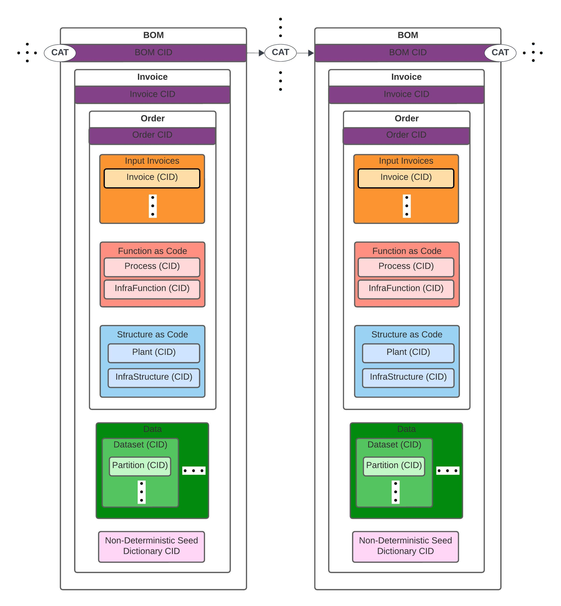

# CAT Composition Lineage as Data Provenance Records

## How are CATs composed as a Lineage of Data Provenance on a Data Mesh?

Because every BOM is Content-Addressed using digest/`ni:` equality (legacy
**[CIDs](https://docs.ipfs.io/concepts/content-addressing/)** [fail closed](W3C.md#6s-cas-only-node)), each CAT's
output data content id is the exact same content the next CAT's input Invoice references (\*).
Retrieval of that content is CAS-over-HTTP (`*_uri` / `GET /ldp/cas/<hex>`), not IPFS CID fetch.
As CATs execute across a **CAT Mesh**, this chains individual CATs' data together into a
verifiable, traceable record of how data moved and was transformed from one CAT to the
next—composing the Mesh's **[data and process lineage & provenance](https://bi-insider.com/posts/data-lineage-and-data-provenance/)**.

This composition gives the Mesh three properties:

- **Verifiability** — content ids can be used to verify the means of processing data (input, transformation/process, output, and infrastructure-as-code (IaC)) at every link in the chain, enabling [Data Verification](https://en.wikipedia.org/wiki/Data_verification).
- **Resilience** — because each link is retrievable by its content id / `*_uri`, any CAT in the lineage can be re-executed from its recorded BOM, making the Mesh resilient to node loss or replay needs.
- **Auditability** — the resulting chain of evidence lets CAT Mesh participants prove [Data Lineage](https://bi-insider.com/posts/data-lineage-and-data-provenance/) end-to-end, from a Data Product's source inputs to its final outputs, across organizational boundaries.

Notes (\*):
* This chains by carrying forward each CAT's output data content — not a stored BOM/Order backward-pointer from the new BOM to the one before it. A BOM's own `content_id` is never written into any content-addressed blob it produces (it's only ever returned transiently in the Node's HTTP response / LDP cache). Recovering *which* BOM produced a given data digest — the "upstream" link — is served by the **Node-local BOM registry** (`BomRegistry`: data → `[bom_ids, …]`; `linkProcess` / `linkStructure` / `linkOrder` accept `content_id=` / `data_uri=` / `bom_uri=` as alternatives to a caller-held `cat_response` — [`BomRegistry.md`](BomRegistry.md)). Legacy `bom_cid=` / `data_cid=` are rejected. The index is Node-local, not mesh-global; remaining gaps are [mesh federation of the index](W3C.md#6g-and-6h-mesh-federation) ([URI-only graph](W3C.md#6d-uri-only-graph) slots are landed). A "downstream" pointer is deferred further still: no BOM can know at creation time who will later consume its output, so that link is only ever discoverable from the consuming CAT's side, going forward. **Function-only mutation** uses `linkProcess()` (new `function_uri`, prior `structure_uri`). **Structure-only mutation** uses `linkStructure()` (new apply-complete `structure_uri` = `{root_uri, plant_uri, infrastructure_uri}`, prior `function_uri`). **Combined mutation** uses `linkOrder()` (Function and/or Structure in one new Order with a single Invoice data chain). A-la-carte helpers remain first-class. Second-Plant interop still needs Plant adapters ([`INTEROP.md` §2f](INTEROP.md#2f-second-plant-interop-incomplete-as-product)); `linkStructure` / `linkOrder` are the Order ops for that prove path.
* The HTTP BOM envelope is Phase 1b **signed** JSON-LD + PROV-O (`@context` / `@type` / `prov:wasAttributedTo` / `prov:wasGeneratedBy`) with **`node_did`** attribution, `invoice_uri` / `log_uri` address refs only ([URI-only graph](W3C.md#6d-uri-only-graph): no `*_cid`), and a Data Integrity `proof` (`eddsa-jcs-2022`) — lineage still chains by content equality (`ni:`), not URL-string equality. Flask HTTP bind is not BOM attribution.
* **Intra-run** stage lineage is also explicit on the signed BOM as `stageLineage`: `prov:Entity` nodes for Invoice stage content ids with `prov:wasDerivedFrom` along data ← integration ← ingress ← input Invoice data (when known), all `prov:wasGeneratedBy` `#executorRun`. Cross-CAT reverse lookup is the Node-local registry above (not mesh-federated yet).

## Where this fits in CATs:

- CATs are compiled and executed as interconnecting services on a **Data Mesh** that grows as organizations communicate CAT provenance records within feedback loops of **[Data Initiatives](https://github.com/DynamicalSystemsGroup/cats?tab=readme-ov-file#continuous-data-initiative-reification)**.
- **CAT Nodes**—the peers that make up the CAT Mesh—are **Data Products** that encapsulate code, data & metadata, and infrastructure, and are portable between client-server cloud platforms and p2p mesh networks with minimal rework.
- The lineage chain composed by BOMs is what allows a **CAT Order** to be updated and re-verified as its constituent Functions (FaaS), Structure (PaaS), and Infrastructure (IaaS) mutate over the CAT's lifecycle (see the [Architectural Quantum](../README.md#cats-architectural-quantum) description in the README).

See also: [README: How are CATs workloads processed as Data Provenance Records?](../README.md#how-are-cats-workloads-processed-as-data-provenance-records) and [CAT Mesh: CATs Data Mesh platform with Data Provenance](../README.md#cat-mesh-cats-data-mesh-platform-with-data-provenance).

## What's inside a BOM's content ids

See **[`BOM.md`](BOM.md)** (especially [CAT Node HTTP BOM response](BOM.md#cat-node-http-bom-response)) for exactly what each Order / BOM **`ni:`** and HTTP **`*_uri`** resolves to: how `order.function_uri`/`order.structure_uri` nest their Process/InfraFunction and Plant/InfraStructure pairs (with concrete example payloads), and how Invoice `structure_as_executed_uri` (observed Plant / ObjectStore nest) differs from those input-side, specified-as-code locators.
